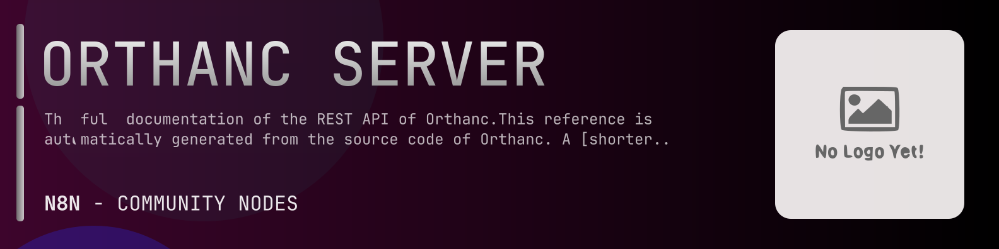

# @n8n-dev/n8n-nodes-orthanc-server



[](https://www.npmjs.com/package/@n8n-dev/n8n-nodes-orthanc-server)
[](https://opensource.org/licenses/MIT)

---

**Stop writing orthanc-server API integrations by hand.**

Every time you connect n8n to orthanc-server, you waste hours mapping endpoints, defining parameters, and debugging schemas. You copy-paste from docs, fix edge cases, and pray nothing breaks.

**What if connecting n8n to orthanc-server took 5 minutes, not half a day?**

This node gives you **10+ resources** out of the box: **Tracking Changes**, **Instances**, **Other**, **Jobs**, **Networking**, and 5 more: with full CRUD operations, typed parameters, and zero manual configuration.

---

## What You Get

- **Zero boilerplate**: Resources, operations, and fields are pre-configured and ready to use
- **Full CRUD**: Create, read, update, and delete support where the API allows it
- **Typed parameters**: No more guessing field types
- **Built-in auth**: API key authentication, ready to go
- **Declarative**: Native n8n performance, no custom execute() overhead

---

## Install

```bash
npm install @n8n-dev/n8n-nodes-orthanc-server
```

**Or in n8n:**
1. **Settings → Community Nodes → Install**
2. Search: `@n8n-dev/n8n-nodes-orthanc-server`
3. Click **Install**

---

## Quick Start

1. Install the node (above)
2. Add credentials: **orthanc-server API** → paste your API key
3. Drag the **orthanc-server** node into your workflow
4. Pick a resource → pick an operation → done.

That's it. No configuration files. No code. It just works.

---

## Resources

| Resource | Operations |
|----------|------------|
| Tracking Changes | Delete clear changes, Get list changes, Delete clear exports, Get list exports |
| Instances | Get list the available instances, Post upload dicom instances, Delete some instance, Post anonymize instance, Get list attachments, Delete attachment, Put set attachment, Post compress attachment, Get attachment no decompression, Get md5 of attachment on disk, Get size of attachment on disk, Get attachment, Get info about the attachment, Get is attachment compressed, Get md5 of attachment, Get size of attachment, Post uncompress attachment, Post verify attachment, Get raw tag, Post write dicom onto filesystem, Get download dicom, Get list available frames, Get decode a frame int16, Get decode a frame uint16, Get decode a frame uint8, Get decode frame for matlab, Get decode frame for numpy, Get decode a frame preview, Get access raw frame, Get access raw frame compressed, Get render a frame, Get dicom metaheader, Get decode an image int16, Get decode an image uint16, Get decode an image uint8, Get decode frame for matlab, Get list metadata, Delete metadata, Put set metadata, Post modify instance, Get instance module, Get decode instance for numpy, Get parent patient, Get embedded pdf, Get decode an image preview, Post reconstruct tags  optionally files of instance, Get render an image, Get parent series, Get humanreadable tags, Get instance statistics, Get parent study, Get dicom tags |
| Other | Get list operations on attachments, Get list operations, Get list operations on attachments, Get list operations on attachments, Get list operations on attachments, Get list operations |
| Jobs | Get list jobs, Post cancel job, Post pause job, Post resubmit job, Post resume job |
| Networking | Get list dicom modalities, Delete dicom modality, Put update dicom modality, Get modality configuration, Post trigger cecho scu, Post cfind scu for worklist, Post trigger cmove scu, Post trigger cfind scu, Post trigger storage commitment request, Post trigger cstore scu, Post straight cstore scu, Get list orthanc peers, Delete orthanc peer, Put update orthanc peer, Get peer configuration, Post send to orthanc peer, Post straight store to peer, Get peer system information, Get list queryretrieve operations, Delete a query, Get list answers to a query, Get one answer, Post query the child instances of an answer, Post query the child series of an answer, Post query the child studies of an answer, Post retrieve one answer, Get level of original query, Get modality of original query, Get original query arguments, Post retrieve all answers, Get storage commitment report, Post remove after storage commitment |
| Patients | Get list the available patients, Delete some patient, Post anonymize patient, Get create zip archive, Post create zip archive, Get list attachments, Delete attachment, Put set attachment, Post compress attachment, Get attachment no decompression, Get md5 of attachment on disk, Get size of attachment on disk, Get attachment, Get info about the attachment, Get is attachment compressed, Get md5 of attachment, Get size of attachment, Post uncompress attachment, Post verify attachment, Get child instances, Get tags of instances, Get create dicomdir media, Post create dicomdir media, Get list metadata, Delete metadata, Put set metadata, Post modify patient, Get patient module, Get is the patient protected against recycling, Put protect one patient against recycling, Post reconstruct tags  optionally files of patient, Get child series, Get shared tags, Get patient statistics, Get child studies |
| System | Get list plugins, Get javascript extensions to orthanc explorer, Get database statistics, Get system information, Get accepted transfer syntaxes, Put set accepted transfer syntaxes, Post anonymize a set of resources, Post describe a set of resources, Post delete a set of resources, Post modify a set of resources, Post create zip archive, Post create one dicom instance, Post create dicomdir media, Post create dicomdir media, Get default encoding, Put set default encoding, Get dicom conformance, Post trigger cecho scu, Post execute lua script, Post look for local resources, Get generate an identifier, Post invalidate dicomasjson summaries, Post look for dicom identifiers, Get are metrics collected, Put enable collection of metrics, Get usage metrics, Get utc time, Get local time, Post reconstruct all the index, Post restart orthanc, Post shutdown orthanc, Get is unknown sop class accepted, Put set unknown sop class accepted |
| Series | Get list the available series, Delete some series, Post anonymize series, Get create zip archive, Post create zip archive, Get list attachments, Delete attachment, Put set attachment, Post compress attachment, Get attachment no decompression, Get md5 of attachment on disk, Get size of attachment on disk, Get attachment, Get info about the attachment, Get is attachment compressed, Get md5 of attachment, Get size of attachment, Post uncompress attachment, Post verify attachment, Get child instances, Get tags of instances, Get create dicomdir media, Post create dicomdir media, Get list metadata, Delete metadata, Put set metadata, Post modify series, Get series module, Get decode series for numpy, Get parent patient, Post reconstruct tags  optionally files of series, Get shared tags, Get series statistics, Get parent study |
| Studies | Get list the available studies, Delete some study, Post anonymize study, Get create zip archive, Post create zip archive, Get list attachments, Delete attachment, Put set attachment, Post compress attachment, Get attachment no decompression, Get md5 of attachment on disk, Get size of attachment on disk, Get attachment, Get info about the attachment, Get is attachment compressed, Get md5 of attachment, Get size of attachment, Post uncompress attachment, Post verify attachment, Get child instances, Get tags of instances, Get create dicomdir media, Post create dicomdir media, Post merge study, Get list metadata, Delete metadata, Put set metadata, Post modify study, Get study module, Get patient module of study, Get parent patient, Post reconstruct tags  optionally files of study, Get child series, Get shared tags, Post split study, Get study statistics |
| Logs | Get main log level, Put set main log level, Get log level for dicom, Put set log level for dicom, Get log level for generic, Put set log level for generic, Get log level for http, Put set log level for http, Get log level for jobs, Put set log level for jobs, Get log level for lua, Put set log level for lua, Get log level for plugins, Put set log level for plugins, Get log level for sqlite, Put set log level for sqlite |

---

## Why This Node?

**Without this node:**
- Hours of manual API integration
- Copy-pasting from orthanc-server docs
- Debugging auth, pagination, error handling
- Maintaining your own client code

**With this node:**
- Install → configure → use. 5 minutes.
- Auto-generated from the official orthanc-server OpenAPI spec
- Always up to date when the API changes
- Native n8n performance

---

## Auto-Generated
This node was auto-generated from the official **orthanc-server** OpenAPI specification using
[@n8n-dev/n8n-openapi-node-ultimate](https://github.com/kelvinzer0/n8n-openapi-node-ultimate),
then validated against the live API so you get accurate types and real parameters, not guesswork.

When the orthanc-server API updates, this node updates too.

---

## Support This Project

If this node saved you hours of work, consider supporting continued development, new APIs, better error handling, and faster updates.

[](https://n8n-code.github.io/membership/#/eyJ0aXRsZSI6IktlZXAgSXQgTW92aW5nIiwiZGVzYyI6Ik9uZSBkZXZlbG9wZXIgYnVpbHQgYSB0b29sIHRoYXQgYXV0by1nZW5lcmF0ZXNcbm44biBub2RlcyBmcm9tIGFueSBPcGVuQVBJIHNwZWMuXG5cbllvdXIgZG9uYXRpb24gZnVuZHMgbmV3IGZlYXR1cmVzLCBtb3JlIEFQSSBzdXBwb3J0LFxuYW5kIGJldHRlciB0b29saW5nIGZvciBldmVyeSBkZXZlbG9wZXIgYWZ0ZXIgeW91LiIsInRhcmdldCI6NTAwMCwiYWRkcmVzc2VzIjp7ImV0aGVyZXVtIjoiMHhmMDU1NWQ0MGRiRkI0ZTNCZjA3MDQ0MjgyQjc4RjJmRTFmNTFFZjcyIiwic29sYW5hIjoiNlpEVk5BYmpZZExEcXo4cGt3VUNHYllaNVV3QlFranB0QzU1Wk5vTFcybVUifSwiZGlzY29yZCI6Imh0dHBzOi8vZGlzY29yZC5nZy9wdERaOGU0aDkzIn0)

---

## License

MIT © [kelvinzer0](https://github.com/n8n-code)
